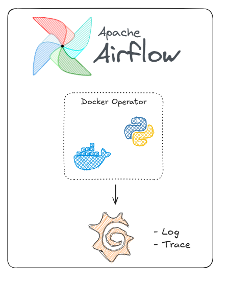

# Grafana Observability
Nessa stack o objetivo é fazer o Airflow orquestrar um processo com o Docker Operator e todos os logs e traces do container serão exportados para o Grafana.

## Architecture


## Video Tutorial
Link: https://youtu.be/kIqbvSd_rH8

## Pré-requisitos

* Docker
* Python

## Como instalar o Docker?
https://www.youtube.com/watch?v=pRFzDVn40rw&list=PLbPvnlmz6e_L_3Zw_fGtMcMY0eAOZnN-H


## Como utilizar o projeto?
clone o repositório com o comando:
```
git clone https://github.com/wlcamargo/airflow-grafana-observability
```
Entre na pasta do projeto:
```
cd airflow-grafana-observability
```
Crie o ambiente virtual
```
python3 -m venv venv
```
Ative o ambiente virtual 

Se estiver no Linux:
```
source venv/bin/activate
```
Se estiver no Windows:
```
venv/scripts/activate
```
Instale as libs do Python com o ambiente virtual ativo
```
pip install -r requirements.txt
```

## Como subir o serviço do Airflow e do Postgres?
Entre na pasta ```docker``` e execute o comando:
```
sudo docker compose up -d
```

## Como rodar a ingestão com Python?
Entre na pasta ```src/``` e execute o programa ```main.py```
```
python3 main.py
```

## Como criar a imagem do ingestor com python?
```
docker build -t python-ingestor-postgres .
```

## Como acessar os serviços?

### Airflow
```
localhost:8081
user: airflow
password: airflow
```

### Grafana
```
localhost:3000
```

### Postgres
```
host: localhost:5435
login: postgres
senha: postgres
```

## 📚 Referências

https://github.com/wlcamargo/opentelemetry

https://www.youtube.com/watch?v=9mifCIFhtIQ&list=PLOQgLBuj2-3IL2SzHv1CHaBBHJEvHZE0m

https://opentelemetry.io/

https://grafana.com/


## 🧑🏼‍🚀 Developer
| Desenvolvedor      | LinkedIn                                   | Email                        | Portfólio                              |
|--------------------|--------------------------------------------|------------------------------|----------------------------------------|
| Wallace Camargo    | [LinkedIn](https://www.linkedin.com/in/wallace-camargo-35b615171/) | wallacecpdg@gmail.com        | [Portfólio](https://wlcamargo.github.io/)   |
